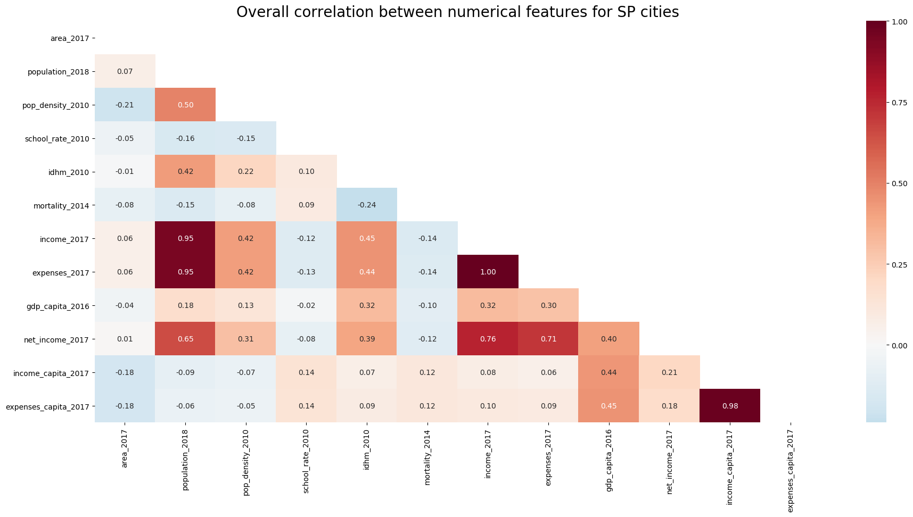

# Public spending data analysis - Municipalities in São Paulo State, Brazil

This is a live project of the data mining and analysis of public expenditure data from all municipalities in São Paulo State, Brazil, excluding the state capital (São Paulo city). This information is publicly available at the Data Transparency website of [São Paulo State Accounting Office (*TCE-SP, Tribunal de Contas do Estado de São Paulo*)](http://transparencia.tce.sp.gov.br/).

Auxiliary information regarding characteristics from each municipality will be obtained from [IBGE website](https://cidades.ibge.gov.br/pesquisas) (Brazilian Institute of Geography and Statistics, *Instituto Brasileiro de Geografia e Estatística*).

The analysis will be done in multiple steps, using several Python notebooks to focus on one analysis at a time.

## TCE-SP_Scrapper.ipynb

The TCE-SP database used in this study is based [here](http://transparencia.tce.sp.gov.br/municipios-csv). It contains a list of every income and expense entry for every municipality in São Paulo state, Brazil (excluding São Paulo city). Each entry has a detailed description of the event, including multiple information on transaction classification, origin/issuer identification and service description.

This notebook basically scrapes this TCE-SP database, generating a list of all `zip` files to be downloaded, separated by year. Each year comprises of around 1GB of compressed `zip` files and the list of files can be found in the [`zip_files`](https://github.com/Lgcsimoes/tce_sp/tree/master/zip_files) folder in this repository.

## TCE-SP_Despesas_MySQL_Upload.ipynb

This notebook allows the TCE-SP database to be imported into a MySQL table (which was created using the [`scripts/create\_table\_despesas.sql`](https://github.com/Lgcsimoes/tce_sp/blob/master/scripts/create_table_despesas.sql) MySQL script). This step is important for future analyses, where only specific columns and rows can be loaded, given that the complete dataset is too large for loading on usual workstations (around 15GB of RAM per year of data).

The data will be appended into `despesas` MySQL table, located inside `db_tce` MySQL database.

## SP state cities - Overview.ipynb

Data was obtained from [IBGE website](https://www.ibge.gov.br/informacoes-por-cidade-e-estado?t=destaques&c=3549904), clicking on *"Exportar*" on the upper right corner and choosing *"Todos os municípios - SP*" and "*CSV*". A `.csv` file will be downloaded with information about every city from São Paulo State. The data exported from IBGE website can also be found on [`db/municipios_SP_IBGE.csv`](https://github.com/Lgcsimoes/tce_sp/blob/master/db/municipios_SP_IBGE.csv).

The notebook presents an exploratory data analysis (EDA), visually inspecting the boxplot and correlation plots, as well as variable skewness. Boxplots are shown below, where a variable dispersion of 1-2 orders of magnitude can be found for income/spending per capita and child mortality rate, indicating a large discrepancy of such parameters between cities in São Paulo State.

The correlation matrix is shown below. Besides some obvious correlations between absolute income, spending and population, IDHM shows some positive correlation to economic variables and a negative correlation to child mortality rate. It is also interesting to note that cities with larger population tend to have higher IDHM.

After correcting variable skewness by transforming current features from `x` to `log(1+x)`, the complete dataframe is saved to a MySQL table for future analyses.

## GeoJSON formatter.ipynb

This *still* preliminary notebook investigates the idea of easily creating an interactive choropleth map for São Paulo State. It exemplifies how to interactively choose to show child mortality rate or IDHM values, colouring every city boundary with a color corresponding to the feature value.

Due to security reasons, GitHub does not allow users to directly open JavaScript webpages from this README file. In order to open the try-out map, download [this file](https://github.com/Lgcsimoes/tce_sp/blob/master/notebooks/images/Choropleth_tryout.html) and open it manually using a web browser. The image below exemplifies this map.

## TCE-SP_Despesas_EDA_2017.ipynb

Data from TCE-SP database is analyzed in this notebook only with respect to spending values separated by city and primary category, non-dimensionalized by each city population. Similar categories were grouped in order to make the analysis easier. Only 167 cities were considered (from a total of 645 cities), excluding the São Paulo city, as well as cities with less than 40,000 inhabitants.

A boxplot analysis shows that administration, education and health are the highest per capita spending categories, followed by social security, social assistance, culture and public security, in descending order. The plot also presents a very large variation in spending per capita between cities.

A clustering analysis was also performed, trying to identify groups of cities with similar patterns of spending per capita. This was made using a simple clustering method (K-means, which considers only linear boundaries for clusters) and also a more complex method (t-SNE, which transform the multi-dimensional feature space into a 2D space, trying to maintain non-linear relationships between data points).

- The K-means method has managed to group cities into two groups: one small group of 11 cities was segregated from the rest, corresponding to cities with around two times more spending per capita for most categories.

- The t-SNE method has managed to group cities into four different clusters, one corresponding to highest spending cities (considering Administration, Culture, Education, Habitation, Public security and Social assistance) and another to lowest spending (considering Administration, Culture, Education, Health and Social assistance).

For both clustering methods, no correlation was found between clusters and their corresponding values for socioeconomic parameters from IBGE database.

## TCE-SP_Despesas_EDA_2017_AllCities.ipynb

The analysis shown before was replicated, now considering a total of 514 cities, excluding São Paulo city and also a few small cities that had no child mortality information in IBGE database.

Most of the conclusions are still valid, however the most impressive conclusion is drawn when analyzing the spending per capita distribution as a function of city population, for each spending category:

- Spendings for administration, education and health clearly show a considerably higher spending per capita for cities smaller than 8,000 inhabitants, without resulting in a better situation on educational or health parameters from IBGE. This may indicate that very small cities are inneficient, since some administration functions do not scale very well for very low population levels, increasing the state overhead.

- Spending on agriculture are inversely proportional to population. This may come from the fact that a city may be less dependant on agriculture the larger it is.

- Spending on Social security is somewhat random as a function of city population, however cities with more than 100,000 inhabitants clearly show an increasing lower bound for this spending category.

- Analyzing the spending per capita range, we can see that most categories span 2 to 3 orders of magnitude difference for the same category, with exception of Administration, Education, Habitation , Health and Social assistance (whose spending per capita tends to span only one order of magnitude). This shows that cities can spend 10 to 100 times more than other cities, with no clear effect on socioeconomic parameters.

